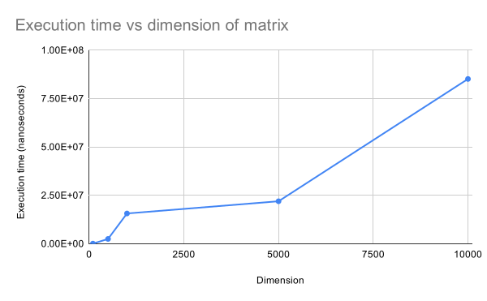

## Matrix multiplication using CUDA

### Machine specifications

| | |
|-|-|
|Environment|Google Colab notebook|
|CUDA|v11.2|
|GPU|Tesla T4|

\
\
Used [nvcc4jupyter](https://github.com/andreinechaev/nvcc4jupyter) plugin to
run C++/CUDA code in Google collab notebooks.

### Timing study

|Dimension of matrix	|Run 1	|Run 2	|Run 3	|Average (nanoseconds)|
|-|-|-|-|-|
|100	|88534	|84869	|87864	|8.71×104|
|500	|2490419	|2483295	|2508935	|2.49×106|
|1000	|15629685	|15703947	|15617744	|1.57×107|
|5000	|21546761	|22386895	|21953473	|2.20×107|
|10000	|84661015	|86524166	|84290646	|8.52×107|

\
\

